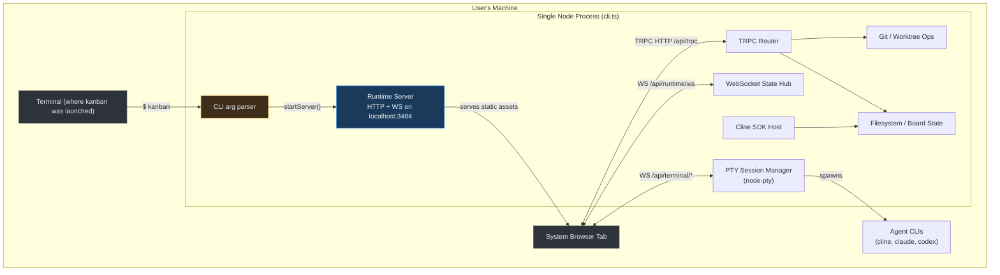
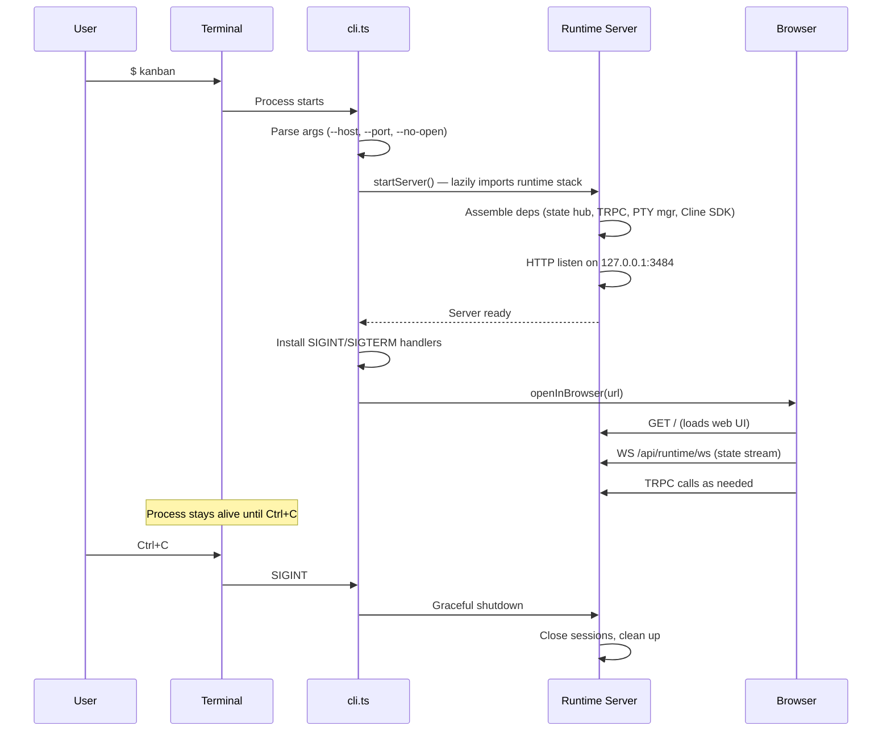
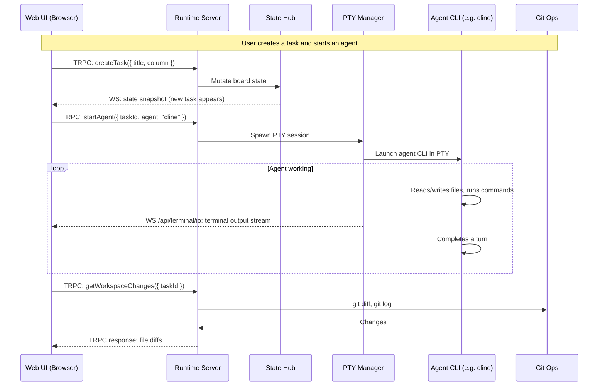
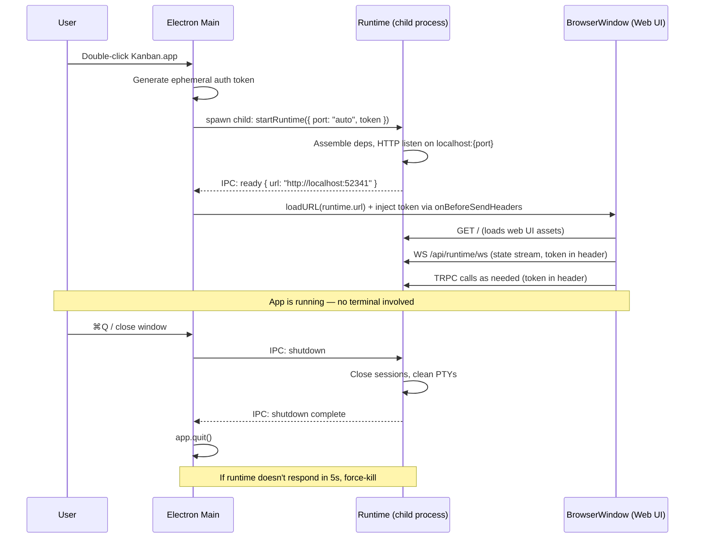
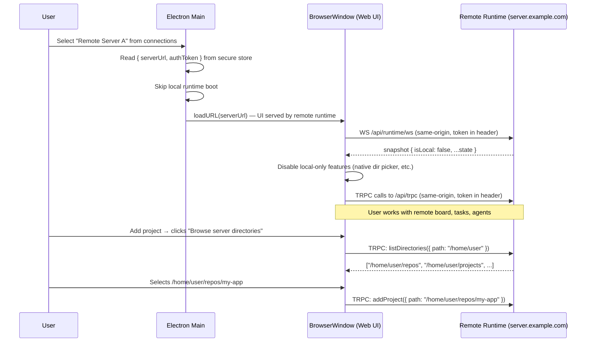
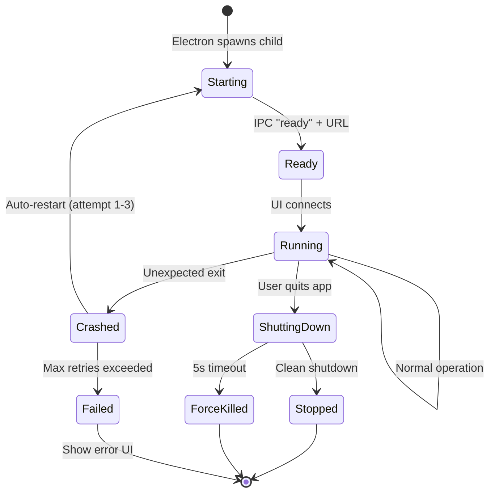

# Desktop App and Runtime Architecture

This document lays out what Kanban's runtime and client architecture looks like today, what we are trying to achieve, the options available, and a recommended path forward.

## Status update (current `feature/desktop-app` state)

This document started as a forward-looking architecture plan. Since then, the major implementation workstreams have landed.

### What is now implemented
- `src/runtime-start.ts` exists as the reusable runtime entrypoint for non-CLI callers.
- The Electron app starts the runtime in a child process and loads the runtime-served web UI in a hardened `BrowserWindow`.
- `ConnectionStore`, `ConnectionManager`, and the connection menu are now wired into `packages/desktop/src/main.ts`.
- Persisted active connections are restored at startup, with fallback to the local connection if a saved target is invalid.
- `RuntimeStartOptions` and `RuntimeCallbacks` now exist as the cleaned-up runtime startup API shape.
- Desktop↔CLI runtime bridging is implemented via env propagation plus runtime-descriptor fallback.
- `asarUnpack` unpacks all `node_modules/**` (see implementation learnings below for why selective unpacking failed).
- Linux packaging config now includes AppImage targets for both `x64` and `arm64`.
- WebSocket auth uses a cookie fallback because Electron's `onBeforeSendHeaders` does not intercept WS upgrades (see implementation learnings below).
- Bundled CLI shim path (`kanbanCliCommand`) is threaded through `ConnectionManager` to the runtime child process so the home-agent prompt references the bundled shim.
- Disconnected fallback UI detects Electron context and shows a desktop-appropriate message with reload button.
- **Startup preflight validation** — `desktop-preflight.ts` checks that `preload.js`, `runtime-child-entry.js`, and the CLI shim exist before boot. Missing resources produce a structured failure dialog with normalized error codes instead of a cryptic crash.
- **Boot phase tracking** — `desktop-boot-state.ts` tracks the app through startup phases (`preflight` → `create-window` → `load-persisted-state` → `initialize-connections` → `ready`). Failures are recorded with typed codes from `desktop-failure-codes.ts`, making diagnostics and future telemetry straightforward.
- **Stale descriptor detection** — `evaluateDescriptorTrust()` uses a per-launch `desktopSessionId` to classify leftover descriptors: dead PID → auto-cleanup, prior desktop session → warn and start fresh, terminal-owned → coexist on separate port.
- **E2E test infrastructure** — Playwright config, `launchDesktopApp()` fixture harness with state isolation seams, and initial `app.spec.ts` skeleton are in place for future packaged-app smoke tests.
- **Package boundary enforcement** — runtime-descriptor functions are exported from `kanban`'s `index.ts` and typed in `kanban.d.ts`. The desktop package imports via the `"kanban"` package boundary, not direct parent-source-tree paths (see learning #4 below).

### What is still not fully verified
- Real Linux desktop validation
- Real Windows packaged-app validation, especially PTY/runtime child behavior
- Auto-update pipeline
- Code signing and notarization for distribution
- E2E test scenarios (infrastructure exists, but no substantive scenarios written yet)

So the main architectural questions in this document are now largely resolved. The remaining work is validation, E2E testing, and distribution infrastructure.

### Implementation learnings (post-build discoveries)

These are non-obvious behaviors discovered during packaging and runtime testing. They are not in the original architecture plan because they only manifest in the packaged Electron context.

#### 1. WebSocket auth requires a cookie fallback

Electron's `session.webRequest.onBeforeSendHeaders` intercepts HTTP requests but **not** WebSocket upgrade requests. This is a Chromium behavior — WS upgrades go through a different network stack path. The `Authorization: Bearer <token>` header that works for TRPC/HTTP is never sent on `new WebSocket()` connections.

**Solution:** `ConnectionManager.installAuthInterceptor()` now does two things:
- Sets `onBeforeSendHeaders` for HTTP requests (existing approach)
- Sets a `kanban-auth` session cookie via `session.cookies.set()` for WebSocket upgrades

The server-side `auth-middleware.ts` accepts the cookie as a fallback via `extractTokenFromCookie()`. Cookie auth is only used when the `Authorization` header is absent.

#### 2. ASAR unpacking must include all node_modules

The original plan selectively unpacked only native addons (`node-pty`, `better-sqlite3`, `@img/*`, etc.). This broke because:
- The runtime child process runs with `ELECTRON_RUN_AS_NODE=1` from `app.asar.unpacked/`
- Module resolution from unpacked paths does **not** fall back to the ASAR archive
- npm hoists transitive dependencies (e.g. `proper-lockfile`, `graceful-fs`) to the top-level `node_modules/` which was inside the ASAR
- Result: `MODULE_NOT_FOUND` errors at runtime startup

**Solution:** `asarUnpack` in `electron-builder.yml` now uses `node_modules/**` to unpack everything. This increases install size (~466MB for node_modules) but is the only approach that doesn't silently break when npm changes hoisting behavior.

**Future optimization:** Use `NODE_PATH` on the child process to resolve modules from inside the ASAR while only unpacking native addons. This could drop the unpacked size to ~30MB.

#### 3. Avoid duplicate auth interceptor and loadURL registration

The `RuntimeChildManager` emits a `ready` event when the runtime process starts (or restarts after crash). Initially, `main.ts` handled this by installing auth interceptors and calling `loadURL()` — but `ConnectionManager.switchToLocal()` already does both. The double registration caused:
- `onBeforeSendHeaders` racing with itself
- Double `loadURL()` calls that broke page load

**Solution:** The `ready` handler in `main.ts` only updates local state and publishes the runtime descriptor. Auth and navigation are `ConnectionManager`'s responsibility exclusively.

#### 4. Desktop must import from the `"kanban"` package boundary, not parent source paths

The desktop package (`packages/desktop/`) depends on kanban via a local tarball (`file:kanban-0.1.57.tgz`). TypeScript's `rootDir` constraint means the desktop `tsconfig` cannot reference files outside `packages/desktop/src/`. Initially, `main.ts` imported `runtime-descriptor.ts` directly from `../../../src/core/runtime-descriptor.js` — this compiled in dev mode but broke the production build because the path was outside `rootDir`.

**Solution:**
- Export runtime-descriptor functions (`writeRuntimeDescriptor`, `clearRuntimeDescriptor`, `evaluateDescriptorTrust`) from `kanban`'s `src/index.ts`
- Add corresponding types to `packages/desktop/src/kanban.d.ts` (the manual declaration file for the tarball dependency)
- Import via `from "kanban"` in `main.ts`
- Add `"./core/runtime-descriptor"` to `package.json` exports map (for deep imports if needed)

**Key lesson:** When the kanban tgz is rebuilt, the desktop lockfile's integrity hash becomes stale. `npm install` will fail with `EINTEGRITY`. Fix: delete `package-lock.json` and run `npm install` to regenerate it. This happens every time the kanban package content changes.

#### 5. Stale descriptor trust evaluation prevents orphaned runtime connections

When the desktop app crashes or is force-killed, the runtime descriptor file (`~/.cline/kanban/runtime.json`) is not cleaned up. On next launch, the app finds a descriptor pointing to a potentially dead runtime. Without trust evaluation, the app could either:
- Try to connect to a dead endpoint (hang on startup)
- Start a new runtime on the same port as the dead one (conflict)

**Solution:** `evaluateDescriptorTrust()` classifies the descriptor into trust decisions:
- `trust` — same desktop session ID, PID is alive → reuse the running runtime
- `clean-and-start` — PID is dead → auto-delete the stale descriptor, start fresh
- `warn-and-start` — PID is alive but different session ID → another desktop instance or terminal CLI owns it, start on a different port
- `start-fresh` — no descriptor exists → normal first boot

Each trust decision is a typed discriminated union (`DescriptorTrustResult`), making it easy to log, test, and extend.

---

## What we are trying to achieve

1. **Users can launch Kanban as a normal macOS, Windows, or Linux desktop application.** No terminal required for the standard workflow.
2. **The app can optionally point its client at a non-local server.** This covers cases where the Kanban runtime is running on a remote machine, a cloud VM, or behind a tunnel.
3. **The architecture stays simple.** Minimize new abstractions and preserve the existing runtime model.

## What exists today

Kanban is already structured as a client/server system:

- A **local Node runtime** (`src/server/runtime-server.ts`) serves the web UI assets, exposes TRPC endpoints, and manages websocket streams.
- A **React web UI** (`web-ui/`) renders state, sends commands, and reacts to live updates via websocket.
- The runtime is the source of truth for projects, worktrees, sessions, and git operations.
- There are two agent execution paths: PTY-backed CLI agents and native Cline SDK sessions.

The gap is not in the runtime architecture. It is in how the runtime gets started and how the client connects to it.

### Current system architecture



Everything runs in one process. The CLI is the entry point. The browser is a dumb client.

### Current startup sequence



### Current request flow during normal use



### Historical startup path

Originally, the entire startup lifecycle lived in `src/cli.ts`:

1. The user runs `kanban` from a terminal.
2. `cli.ts` parses CLI arguments (`--host`, `--port`, `--no-open`, etc.).
3. `startServer()` lazily imports the runtime stack and assembles all dependencies.
4. The runtime HTTP server starts listening on `127.0.0.1:3484` (or a configured host/port).
5. `openInBrowser()` launches the user's default browser.
6. Graceful shutdown handlers are installed on `process` signals.
7. The process stays alive, serving HTTP + websocket traffic until the user hits Ctrl+C.

That CLI-only shape worked well for browser/CLI usage but originally prevented desktop-app packaging because:

- Runtime boot logic is tangled with CLI argument parsing and terminal-specific UX (spinners, `console.log`, `Ctrl+C` prompts).
- There is no reusable function a non-CLI caller (like an Electron main process) can invoke.
- Browser opening, directory picking, and shutdown are all wired for a CLI context.

### Current client-server transport

The web UI connects to the runtime using relative URLs:

| Transport | Client code | Server code |
| --- | --- | --- |
| TRPC HTTP | `url: "/api/trpc"` in `web-ui/src/runtime/trpc-client.ts` | `basePath: "/api/trpc/"` in `runtime-server.ts` |
| Runtime websocket | `${protocol}//${window.location.host}/api/runtime/ws` in `use-runtime-state-stream.ts` | upgrade handler on `/api/runtime/ws` in `runtime-server.ts` |
| Terminal websocket | `/api/terminal/io` and `/api/terminal/control` | terminal WS bridge in `runtime-server.ts` |

Because the UI uses relative paths derived from `window.location`, it automatically works when the server and client are co-located. Since the recommended architecture always serves the UI from the runtime (see "Electron is a managed browser window, not a UI bundle"), this relative URL pattern works unchanged in every connection mode — local, remote desktop, remote browser, and WSL.

### Current local-only assumptions

These are the places in the codebase where local-machine access is assumed:

| Assumption | File | What it does |
| --- | --- | --- |
| Runtime endpoint is always `http://127.0.0.1:{port}` | `src/core/runtime-endpoint.ts` | Constructs all server-side URLs from localhost |
| Directory picker shells out to OS commands | `src/server/directory-picker.ts` | Uses `osascript` (macOS), `zenity`/`kdialog` (Linux), PowerShell (Windows) |
| Browser opening uses system `open` | `src/server/browser.ts` | Opens URLs in the user's default browser via the `open` package |
| MCP OAuth callback URLs are built from localhost origin | `src/cline-sdk/cline-mcp-runtime-service.ts` | Constructs `buildKanbanRuntimeUrl(OAUTH_CALLBACK_PATH)` |
| Graceful shutdown is wired to process signals | `src/cli.ts` | `installGracefulShutdownHandlers` on `SIGINT`/`SIGTERM` |
| WebSocket URL is derived from `window.location` | `web-ui/src/runtime/use-runtime-state-stream.ts` | `${protocol}//${window.location.host}/api/runtime/ws` |

Most of these are fine for local mode and only need attention in remote mode.

## Options considered

### Option A — Keep CLI as the only launcher

Do nothing. Users continue to launch Kanban from a terminal.

**Pros:** Zero effort.
**Cons:** Fails the product goal. No desktop app. No remote support.

**Verdict:** Not viable if we want desktop and remote use cases.

### Option B — Extract runtime boot + add Electron desktop shell (local only)

Extract a reusable `startRuntime()` function from `cli.ts`. Build an Electron app that calls it, loads the web UI in a `BrowserWindow`, and manages the process lifecycle.

**Pros:**
- Smallest change that achieves the desktop launch goal.
- Reuses the existing Node runtime and `node-pty` without modification.
- Web UI continues to use relative URLs (same-origin).

**Cons:**
- Does not address the remote server use case.
- Adds Electron packaging, signing, and update infrastructure.

**Verdict:** Good first step, but incomplete.

### Option C — Electron desktop shell + optional remote server URL

Same as Option B, plus: the app supports a configurable `serverUrl` setting. When set, the client skips local runtime boot and connects to the remote server instead.

**Pros:**
- Covers both local and remote use cases.
- Simple implementation: a URL field in settings, absolute vs. relative URL branching in the client.

**Cons:**
- Needs auth for remote connections.
- Some features (directory picker, process-level operations) need to be disabled or adapted when remote.

**Verdict:** Recommended approach.

### Option D — Tauri or other non-Electron shell

Use Tauri (Rust-based) or a similar lightweight shell instead of Electron.

**Pros:**
- Potentially smaller binary footprint.

**Cons:**
- `node-pty` is a native Node addon. It is central to Kanban's PTY agent execution path. In Tauri, you would need to either:
  - Run a separate Node sidecar process (defeating the footprint advantage).
  - Rewrite PTY management in Rust (massive effort, high risk).
- The entire runtime is Node-based. Tauri's Rust backend would not reduce complexity; it would add a second runtime language.

**Verdict:** Not viable given Kanban's Node and `node-pty` dependencies.

### Option E — Full capability negotiation protocol

Add a `runtime.getCapabilities` endpoint that returns fine-grained flags (e.g., `supportsWorkspacePathPicker`, `supportsLocalTerminalSpawn`, `supportsProcessControl`). The UI would query capabilities on connect and conditionally enable features.

**Pros:**
- Maximally flexible for future runtime modes.

**Cons:**
- The capability set is currently binary: local (everything works) vs. remote (a few things don't). A protocol is overkill for a boolean.
- Adds complexity before there is a real second runtime mode to test against.

**Verdict:** Premature. Start with a simple `isLocal` flag. Graduate to capabilities later if the set grows.

## Recommended architecture

Adopt **Option C**: extract the runtime boot path, package it in Electron for desktop use, and add a simple remote server URL configuration.

**Status:** this is now the implemented direction. The remaining work is verification of the packaged/runtime behavior rather than selecting an architecture.

### North-star: all connection modes

```mermaid
graph TB
    subgraph "Connection Mode A: Desktop Local"
        EA["Electron Main Process"]
        EA -->|"spawn child process"| RTA["Kanban Runtime<br/>localhost:{auto-port}"]
        EA -->|"BrowserWindow"| UIA["Web UI<br/>(relative URLs)"]
        UIA <-->|"same-origin"| RTA
    end

    subgraph "Connection Mode B: Desktop Remote"
        EB["Electron Main Process"]
        EB -->|"BrowserWindow navigates to serverUrl"| UIB["Web UI<br/>(served by remote runtime)"]
        UIB <-->|"same-origin"| RTB["Remote Kanban Runtime<br/>server.example.com:3484"]
    end

    subgraph "Connection Mode C: Browser Remote"
        BrowserC["Any Browser"]
        BrowserC <-->|"network<br/>(relative URLs)"| RTC["Remote Kanban Runtime<br/>server:3484 (--host 0.0.0.0)"]
    end

    subgraph "Connection Mode D: Desktop + WSL (Phase 3)"
        ED["Electron Main Process<br/>(Windows)"]
        ED -->|"wsl.exe -d Ubuntu -e kanban"| RTD["Kanban Runtime<br/>(inside WSL2)"]
        ED -->|"BrowserWindow"| UID["Web UI<br/>(absolute URLs → localhost)"]
        UID <-->|"WSL2 port forwarding"| RTD
    end

    style EA fill:#1a3a5c,stroke:#4C9AFF,color:#E6EDF3
    style EB fill:#1a3a5c,stroke:#4C9AFF,color:#E6EDF3
    style ED fill:#1a3a5c,stroke:#4C9AFF,color:#E6EDF3
    style RTA fill:#1a3a1a,stroke:#3FB950,color:#E6EDF3
    style RTB fill:#1a3a1a,stroke:#3FB950,color:#E6EDF3
    style RTC fill:#1a3a1a,stroke:#3FB950,color:#E6EDF3
    style RTD fill:#1a3a1a,stroke:#3FB950,color:#E6EDF3
```



### Desktop local startup sequence (north star)



### Desktop remote connection sequence (north star)



### Runtime child process lifecycle (north star)



### Local desktop mode

```text
+--------------------------------------------------+
| Electron main process                            |
|                                                  |
| 1. Generate ephemeral auth token                 |
| 2. startRuntime({ port: "auto", token })         |
| 3. Load web UI in BrowserWindow                  |
| 4. Inject token via onBeforeSendHeaders          |
+--------------------------------------------------+
         |                          |
         | child process            | BrowserWindow
         v                          v
+------------------+     +---------------------+
| Kanban runtime   |     | Web UI              |
| HTTP + WS on     |<--->| Relative URLs       |
| localhost:{port} |     | (same origin)       |
+------------------+     +---------------------+
```

- Electron's main process starts the Kanban runtime as a child process. This isolates the runtime from the renderer — if the runtime crashes, the UI stays alive and can restart it.
- An ephemeral random token is generated at startup and passed to the runtime child (via env var). Electron injects it into all HTTP/WS requests via `session.webRequest.onBeforeSendHeaders` — the renderer never sees it directly. This provides local auth without user-visible UX. (This is the same pattern VS Code uses for its remote server.)
- The web UI loads from the local runtime's HTTP server and uses relative URLs exactly as it does today.
- Directory picker can use Electron's `dialog.showOpenDialog()` instead of shelling out to OS commands.

### Remote mode (desktop)

```text
+--------------------------------------------------+
| Electron main process                            |
|                                                  |
| 1. Read serverUrl from saved connections         |
| 2. Skip local runtime boot                       |
| 3. Navigate BrowserWindow to serverUrl           |
| 4. Inject auth token                             |
+--------------------------------------------------+
                           |
                           | BrowserWindow navigates to serverUrl
                           v
                 +---------------------+
                 | Web UI              |          +------------------+
                 | (served by remote   |<-------->| Remote Kanban    |
                 |  runtime, same-     |          | runtime          |
                 |  origin)            |          +------------------+
                 +---------------------+
```

- When a remote connection is selected, the app does not start a local runtime.
- The BrowserWindow navigates directly to the remote server's URL. The web UI is served by the remote runtime, so all API calls are same-origin — no CORS issues.
- The user provides an auth token for the remote server (stored securely in Electron's secure store). Electron injects it via `session.webRequest.onBeforeSendHeaders` — all HTTP and WebSocket requests to the server get an `Authorization` header added automatically. The web UI code doesn't need to know about the token at all.
- The runtime sends an `isLocal: boolean` flag in the initial websocket snapshot message. The UI uses this to disable features that require server-local machine access (e.g., native directory picker).

### Remote mode (browser)

Remote access also works from a regular browser tab without the desktop app. If someone runs the runtime on a server with `kanban --host 0.0.0.0`, any browser on the network can open the runtime URL directly. The web UI uses relative URLs when no `serverUrl` override is configured, so this already works today. The desktop app is not required for remote mode — it just adds connection management, auth token injection, and feature gating that you would otherwise handle manually.

### What changes in the runtime

Very little. The runtime server itself does not need to know whether it is being launched by the CLI, by Electron, or accessed remotely. The changes are:

1. **Extract `startRuntime()` from `cli.ts`.** This is the main refactor. It turns the runtime boot path into a callable function.
2. **Add `isLocal` to the snapshot message.** One new boolean field so the UI can branch on local vs. remote.
3. **Accept an optional auth token.** The runtime validates it on HTTP and websocket connections.

### What changes in the web UI

Because the UI is always served by the runtime (see "Electron is a managed browser window, not a UI bundle"), the existing relative URL pattern (`/api/trpc`, `window.location`-derived WebSocket URLs) works unchanged in every connection mode. The only UI change needed:

1. **Feature gating on `isLocal`.** Disable the directory picker button (and similar local-only affordances) when connected to a remote server. Show the server-side directory browser instead.

### What does not change

- The runtime's internal architecture (TRPC router, state hub, terminal manager, Cline SDK integration).
- The PTY and Cline execution paths.
- Workspace and board state management.
- The CLI launcher (it remains a supported way to run Kanban).

## Key design decisions

### Electron is a managed browser window, not a UI bundle

The web UI is always served by the runtime it connects to. The Electron app does not bundle or ship its own copy of the web UI.

- In local mode, the BrowserWindow loads from `http://localhost:{port}` (the local child process).
- In remote mode, the BrowserWindow navigates to `serverUrl` and loads the web UI from the remote server.

This means version compatibility is guaranteed by design — the client and server are always the same build. There is no client/server version skew problem to solve. The Electron app is genuinely just a shell that manages connections, auth tokens, and process lifecycle.

### Extract a function, not a framework

The runtime boot extraction should produce something like:

```typescript
export interface RuntimeCallbacks {
  /** Warning logger. CLI uses console.warn; child process forwards via IPC. */
  warn?: (message: string) => void;
  /** Async directory picker. CLI wraps the existing spawnSync OS dialog.
   *  Electron uses dialog.showOpenDialog(). */
  pickDirectory?: () => Promise<string | null>;
  /** Open a URL in the user's browser. Added in Phase 1 for Electron IPC.
   *  CLI uses the `open` package directly (not via this callback). */
  openExternal?: (url: string) => void;
}

export interface RuntimeStartOptions {
  workspacePaths?: string[];
  host?: string;
  port?: number | "auto";
  authToken?: string;
  callbacks?: RuntimeCallbacks;
}

export interface RuntimeHandle {
  url: string;
  shutdown: (options?: { skipSessionCleanup?: boolean }) => Promise<void>;
}

export async function startRuntime(options?: RuntimeStartOptions): Promise<RuntimeHandle>
```

The CLI calls `startRuntime()` directly in-process — callbacks work as plain function references. A test harness can also call it in-process.

**For Electron, the model is different.** Because the runtime runs as a child process (decision #6), Electron does not call `startRuntime()` directly. Instead:
- The child process calls `startRuntime()` internally (no callbacks needed from Electron).
- Electron orchestrates the child process via IPC (spawn, ready signal, shutdown).
- Host-specific behaviors like `openExternal` and `pickDirectory` are handled through IPC messages: the child process sends `{ type: "open-external", url }` and the Electron main process responds by calling `shell.openExternal()`.

The callbacks interface is for in-process callers (CLI, tests). The child-process IPC protocol is the Electron equivalent. Both are thin — if either grows beyond 3–4 operations, that's a sign the boundary is wrong.

### Use Electron

The runtime is Node-based and depends on `node-pty`. Electron runs Node natively in its main process. This is the path of least resistance and the one that preserves existing behavior with minimal adaptation.

### Multi-connection support in Electron store

Connection settings live in Electron's secure store (desktop-only, not shared with CLI). The app supports multiple saved connections so a user can switch between local mode, Remote Server A, Remote Server B, etc. Each connection has a name, `serverUrl`, and optional `authToken`. Each connection scopes its own workspace state — workspace IDs from one server are not valid on another.

When a remote connection is active, skip local runtime boot and point the web UI at that URL. There is no SSH tunnel manager or multi-hop proxy system. Those can be added later if usage demands them.

### Start with `isLocal`, not a capability framework

The initial snapshot message gains one field:

```json
{
  "type": "snapshot",
  "isLocal": true,
  ...existing fields...
}
```

The UI uses it to gate local-only features. If the set of remote-mode feature differences grows beyond a few items, a structured capability object can replace the boolean later.

### Server-side directory browser for remote mode

When connected to a remote server, the native directory picker is useless (picks local paths, but the server needs server-side paths). The runtime should expose a sandboxed directory listing endpoint:

- Scoped to the user's home directory or a configured base path (not arbitrary filesystem traversal).
- Only lists directories, not files.
- Requires the auth token.
- The UI renders a simple file-tree picker against this endpoint in remote mode.

### OAuth stays on existing localhost callback flow

Kanban already handles MCP OAuth callbacks via `buildKanbanRuntimeUrl(OAUTH_CALLBACK_PATH)` — the system browser opens for OAuth, the provider redirects back to `http://127.0.0.1:{port}/...`, and the runtime captures the token. This pattern (used by Slack, Discord, VS Code, and others) works unchanged in Electron local mode.

For remote mode, the callback URL would need to resolve to the server's reachable address. This is a Phase 3+ concern. For initial remote support, MCP OAuth may not work and should be documented as a known limitation.

Phase 3 enhancement: register a custom protocol handler (`kanban://`) via `app.setAsDefaultProtocolClient()` so the system browser can deep-link back to the Electron app directly, avoiding the localhost callback hop.

### One runtime connection at a time

The desktop app connects to exactly one runtime at a time — either the local embedded runtime or one remote server. There is no split-screen mode where local projects and remote projects are visible simultaneously. Switching connections resets the workspace context entirely.

This is a deliberate constraint. Supporting multiple simultaneous connections would require the UI to scope every piece of state (board, sessions, terminal streams) to a connection, which would be a significant complexity increase for unclear user benefit. If the need arises later, multi-connection can be revisited, but v1 should not attempt it.

### Electron security hardening

The BrowserWindow **must** be configured with:

```typescript
webPreferences: {
  nodeIntegration: false,      // No Node APIs in the renderer
  contextIsolation: true,      // Isolate preload from page JS
  sandbox: true,               // Chromium sandbox enabled
  webSecurity: true,           // Enforce same-origin policy
  devtools: false,             // Disabled in production builds
}
```

Without these, any JavaScript running in the rendered page (including XSS via user-generated task titles, MCP-loaded content, or browser extension injection) would have full Node.js access — `require('child_process')`, filesystem access, everything.

Additionally, the runtime should serve `Content-Security-Policy` headers on HTML responses:
```
Content-Security-Policy: default-src 'self'; script-src 'self'; style-src 'self' 'unsafe-inline'; connect-src 'self' ws: wss:; img-src 'self' data:
```

This prevents injected scripts from loading external resources or exfiltrating data.

### Auth token injection uses `onBeforeSendHeaders` + cookie, not preload

Auth tokens are injected at the Electron network layer — the renderer and web UI code never see the token directly.

**Two complementary mechanisms are used:**
1. `session.webRequest.onBeforeSendHeaders` — adds `Authorization: Bearer <token>` to all HTTP requests. This covers TRPC and static asset requests.
2. `session.cookies.set()` — sets a `kanban-auth` session cookie. This covers **WebSocket upgrade requests**, which Chromium routes through a different network stack path that bypasses `onBeforeSendHeaders`.

The server-side `auth-middleware.ts` checks the `Authorization` header first, then falls back to the `kanban-auth` cookie. This dual approach was discovered during packaging — see "Implementation learnings" above.

Do **NOT** expose the token via `window.__KANBAN_AUTH_TOKEN__` or any preload script. Any JavaScript running in the page (including third-party scripts loaded by MCP tools or injected by browser extensions) could read it.

In local desktop mode, the token is ephemeral — generated at startup, never persisted, discarded on quit. In remote mode, it is user-provided and stored encrypted in Electron's secure store. Both paths use the same dual injection mechanism.

### Single instance lock

The Electron app uses `app.requestSingleInstanceLock()` on startup. If a second instance is launched, it focuses the existing window instead of spawning a new runtime child. Without this, two Kanban.app instances would have two runtimes fighting over the same `~/.kanban/` state directory, leading to data corruption.

When the second-instance event fires, the existing app should:
- Focus the existing BrowserWindow
- If the second invocation included a path argument (e.g., from "Open With"), navigate to that workspace

### Orphaned child self-termination

If the user force-quits Electron (e.g., `kill -9`, Activity Monitor → Force Quit, or Task Manager → End Process), the `before-quit` handler never runs and the runtime child becomes orphaned. The child process should detect this and self-terminate.

**Mechanism:** The child process sends a heartbeat IPC `{ type: "heartbeat" }` every 5 seconds. The Electron main process responds with `{ type: "heartbeat-ack" }`. If the child doesn't receive an ack within 15 seconds (3 missed beats), it initiates graceful self-shutdown and exits.

Alternative on Unix: check `process.ppid` — if the parent PID changes to 1 (init/launchd adopted the orphan), the parent is gone. This doesn't work on Windows, so the heartbeat approach is the cross-platform solution.

### macOS App Nap protection

macOS aggressively throttles background processes via App Nap. If the Electron window is minimized or hidden, the runtime child process could be throttled, slowing agent execution and delaying WebSocket updates.

**Mitigations:**
- Set `app.commandLine.appendSwitch('disable-renderer-backgrounding')` in the main process
- Set `NSSupportsAutomaticTermination = false` and `NSSupportsSuddenTermination = false` in `Info.plist`
- The child process runs agents that perform real work — macOS should not throttle it. But if we observe throttling, the child can take a `NSProcessInfo.beginActivity` assertion via a native addon (VS Code does this).

### Crash loop time-decay

The auto-restart counter (max 3 attempts) should include a time-decay window. If the runtime runs successfully for 5+ minutes before crashing, the counter resets to 0. This distinguishes between:
- **Startup crash loop** (config error, missing dependency): 3 quick crashes → show error
- **Runtime crash** (after minutes/hours of use): restart is almost certainly the right move, counter shouldn't be exhausted

### TLS delegation model

The runtime always serves plain HTTP. TLS termination is the reverse proxy's job.

**Rationale:** Adding `--cert` / `--key` flags to the runtime would create a maintenance burden (certificate renewal, format handling, error messages) for something nginx/caddy handle better. Every production deployment that needs TLS already has a reverse proxy.

**What the desktop app does:**
- When the user enters a remote `serverUrl`, the URL scheme determines TLS: `https://` → TLS (via proxy), `http://` → plaintext.
- If the scheme is `http://` and the host is not `localhost`/`127.0.0.1`, show a warning in the connection dialog: "⚠️ This connection is not encrypted. Use HTTPS for non-local servers."
- WebSocket follows the same scheme: `wss://` for HTTPS, `ws://` for HTTP. This happens automatically via `window.location.protocol`.

### `runtimeVersion` in the snapshot message

The initial WebSocket snapshot message includes the runtime's version:

```json
{
  "type": "snapshot",
  "isLocal": true,
  "runtimeVersion": "0.42.0",
  ...existing fields...
}
```

The Electron app compares this to its bundled runtime version. While the project is pre-1.0 (`0.x.y`), compare on the **minor** version — per semver, any minor bump in `0.x` can be breaking. After `1.0`, switch to **major** version comparison. Show a non-blocking warning on mismatch: "This server is running Kanban vX, but your app expects vY. Some features may not work correctly."

This matters because:
- The UI is always served by the runtime (no UI version skew) — but the Electron app itself may parse snapshot fields or IPC messages that changed between versions.
- In remote mode, the server could be running any version.
- In local mode, this is guaranteed to match (the child uses the bundled runtime), so the check is a no-op.

### Windows + WSL strategy

Many Windows developers have their repos, tools, and agents inside WSL. The Kanban desktop app should support this by treating "runtime in WSL" as a managed variant of remote mode.

**How other dev tools handle it:**
- **VS Code** auto-detects WSL distros via `wsl.exe --list`, lets the user pick one, then launches a server inside WSL and connects the native Windows UI to it. This is the gold standard.
- **JetBrains** detects WSL distros but requires manual toolchain configuration.
- **Docker Desktop** auto-detects WSL2 and uses it as its backend transparently.

**Recommended approach for Kanban:**

Phase 2 (ships with remote support):
- WSL runtime works out of the box as a manual remote connection — user starts `kanban` inside WSL, Electron connects via `localhost:{port}`.

Phase 3 (convenience):
- Auto-detect WSL availability on Windows (`wsl.exe --list --quiet`).
- If WSL is present, offer a "WSL" connection type alongside Local and Remote.
- When selected, Electron spawns the runtime via `wsl.exe -d <distro> -e kanban --host 0.0.0.0 --port <port>` and connects to it automatically.
- Parse the runtime URL from the WSL child process's stdout to know when it's ready. The runtime already prints `Kanban running at http://...` to stdout — the Electron main process watches for this line. This is the standard pattern (VS Code does the same when launching its remote server in WSL).
- Directory picker in WSL mode uses the server-side directory browser (same as remote mode — Windows paths are meaningless for WSL repos).

This follows the VS Code pattern: detect → pick distro → launch backend → parse stdout for URL → connect UI.

### Package `exports` map enforces the public API boundary

Phase 0 creates `src/runtime-start.ts` as the public API for non-CLI callers. But without an `exports` map in `package.json`, the Electron child process could import any internal module (`import { createRuntimeServer } from "kanban/server/runtime-server"`). This makes the "public API" a convention, not a contract.

Add to `package.json`:
```json
{
  "exports": {
    ".": "./dist/index.js",
    "./runtime-start": "./dist/runtime-start.js",
    "./server/directory-picker": "./dist/server/directory-picker.js"
  }
}
```

This makes `startRuntime()` the official entry point. If the Electron child needs something not in the exports map, it must be explicitly added — a forcing function for intentional API design.

### `/api/health` lightweight endpoint

The runtime should expose a `GET /api/health` endpoint returning `200 OK` with `{ "status": "ok", "version": "0.x.y" }`. This is useful for:
- **Electron main process:** `powerMonitor.on("resume")` can do a quick HTTP GET instead of IPC for health checks
- **External monitoring:** Uptime checks for remote deployments
- **Load balancers:** Health probes when the runtime sits behind a reverse proxy

Five lines of code. No auth required (it's a health check, not data). Add in Phase 1.

### Keyboard shortcut non-interference

The web UI already has keyboard shortcuts (via `src/config/shortcut-utils.ts`). These "just work" inside BrowserWindow. However, Electron's default application menu intercepts some shortcuts:
- ⌘H (Hide) conflicts with any web UI shortcut on H
- ⌘M (Minimize) conflicts similarly
- ⌘W (Close Window) will close the BrowserWindow

**Mitigation:** Build a custom Electron menu (`Menu.buildFromTemplate`) that only registers shortcuts that don't conflict with the web UI. Or use `menu.setApplicationMenu(null)` to remove the default menu entirely and let all keyboard events flow to the web UI — but this loses standard macOS menu bar items (Edit → Copy/Paste, etc.).

Recommended: Custom menu with standard Edit operations (Copy, Paste, Select All) and app lifecycle (Quit, Minimize, Close Window), but no custom shortcuts that might conflict.

### Tasks interrupted notification on restart

When the user quits and reopens the app, in-memory PTY sessions are gone. Tasks that were "Running" are now "Interrupted." This is correct behavior but jarring.

On app restart, if the board state contains tasks in an interrupted/stale agent state, show a toast: "3 tasks were interrupted when the app was closed." Link to filtered view of interrupted tasks. This is Phase 1 UX — it's the first thing a returning user sees.

### Module resolution for child process imports

The child process (`runtime-child.ts`) imports from `"kanban/runtime-start"`. This resolves via:
- **Development (monorepo):** npm workspaces link the `kanban` package, so `import "kanban/runtime-start"` resolves to `src/runtime-start.ts` via TypeScript paths
- **Production builds:** `kanban` is a real dependency in `packages/desktop/node_modules/kanban/`, installed from the registry. The `exports` map (see above) controls what's importable.

The child process is NOT bundled (Webpack/esbuild) — it runs as plain Node.js with access to `node_modules`. Bundling would break `node-pty` (native addon) and dynamic `import()` calls in the runtime.

### Expected binary size

Electron apps are large. Expected sizes:
- macOS `.dmg`: ~180–220 MB (Chromium: ~120 MB, Node: ~40 MB, app code + deps: ~20–60 MB)
- Windows `.nsis` installer: ~150–190 MB (similar breakdown)

This is comparable to VS Code (~300 MB), Cursor (~350 MB), and Slack (~250 MB). Users accustomed to lightweight CLI tools may be surprised. The Electron choice is driven by `node-pty` requiring a Node runtime (see "Option D — Tauri" in options considered).

### CLI stays as-is

No remote extension for the CLI in the near term. If the feature already exists in the runtime, it's implicitly available, but the CLI does not gain new `--remote` flags. Remote is a desktop-app feature.

## Resilience model

How the desktop app recovers from real-world disruptions.

### Sleep/wake (lid close and reopen)

When the user closes the laptop lid, the OS suspends all processes. When it reopens:

**Local mode:**
- The runtime child process was suspended alongside the Electron main process. Both resume simultaneously.
- **WebSocket:** The in-process WS connection between BrowserWindow and the child process survives sleep on macOS (the kernel keeps local TCP sockets alive through suspend). On Windows, `localhost` connections also survive short sleeps but may drop after extended hibernation.
- **PTY sessions:** The agent processes inside PTYs were also suspended. They resume, but agents with timeouts (e.g., API request timeouts) may have expired during sleep. This is not a Kanban problem — it's how every terminal app behaves.
- **Timers:** `setTimeout`/`setInterval` timers in both the runtime and UI accumulate during sleep and fire immediately on wake. The existing exponential backoff reconnect in `use-runtime-state-stream.ts` handles this correctly — it will detect the connection is still alive and do nothing, or detect it's dead and reconnect.
- **Action needed:** The Electron main process should listen for the `powerMonitor.on("resume")` event and ping the runtime child to verify it's responsive. If the child doesn't respond within 3 seconds, restart it. *(Implementation: Task 1.4 acceptance criteria.)*

**Remote mode:**
- The WS connection is almost certainly dead after sleep (TCP keepalives will have timed out on the server side).
- The reconnection logic in `use-runtime-state-stream.ts` (exponential backoff with `STREAM_RECONNECT_BASE_DELAY_MS` / `STREAM_RECONNECT_MAX_DELAY_MS`) handles this. On wake, the first reconnect attempt fires immediately (accumulated timer), and either succeeds or starts backing off.
- **Action needed:** On `powerMonitor.on("resume")`, if in remote mode, trigger an immediate WS reconnect attempt (don't wait for the backoff timer). Show a brief "Reconnecting..." banner. *(Implementation: Task 3.4 reconnection UX.)*

### Network transitions (WiFi change, VPN disconnect)

**Local mode:** Unaffected. All traffic is `localhost`.

**Remote mode:**
- Changing WiFi networks drops all TCP connections. The WS will die.
- The existing reconnect logic handles this, but the new network may have a different IP or the remote server may be unreachable.
- **Action needed:** Listen for Electron's `powerMonitor.on("unlock")` and the `online`/`offline` events on `navigator`. When the network comes back, trigger an immediate reconnect. If the remote server is no longer reachable (e.g., switched from office WiFi to coffee shop), show "Cannot reach server" with the server URL and a manual retry button.

### Runtime crash recovery

The child process state diagram covers restart attempts, but here's what happens to in-flight work:

**What survives a crash:**
- Board state (columns, tasks, cards) — persisted to `~/.kanban/` on every mutation. Survives any crash.
- Workspace configuration — on disk, immutable during a session.
- Task session summaries — written to disk on state changes.

**What does NOT survive a crash:**
- Active PTY sessions — all agent processes are children of the runtime child process. When the child dies, all PTYs are killed by the OS. This is the correct behavior (orphaned agents would be worse).
- In-flight TRPC requests — will fail with network errors. The UI should show toast errors and allow retry.
- Terminal output buffer — the in-memory terminal scrollback is lost. On restart, the terminal starts fresh.
- WebSocket state stream — the UI will get a disconnect event, then reconnect to the restarted runtime and receive a fresh snapshot.

**Recovery sequence:**
1. Runtime child exits unexpectedly.
2. Electron main detects via `child.on("exit")`.
3. If restart attempts remain (< 3): spawn new child, wait for `ready` IPC.
4. BrowserWindow shows a brief "Runtime restarting..." overlay (not a blank page — the current HTML stays visible).
5. New child sends `ready` with new URL (port may differ).
6. BrowserWindow navigates to new URL. UI loads, connects WS, gets fresh snapshot from disk state.
7. User sees their board exactly as before (disk state), but any running agent sessions are gone (as expected after a crash).

If 3 restarts fail: show an error page with "Runtime failed to start" and a "View Logs" / "Restart" button.

### Exception handling strategy

**Runtime child process (Node):**
- `process.on("uncaughtException")`: Log the error, attempt graceful shutdown of PTY sessions, then `process.exit(1)`. The Electron main process handles restart.
- `process.on("unhandledRejection")`: Same treatment. Log and exit.
- Do NOT attempt to "continue running" after unhandled exceptions — the process state is potentially corrupted.

**Electron renderer (BrowserWindow):**
- React error boundaries catch component-level crashes and show a fallback UI without killing the whole page.
- `window.onerror` and `window.onunhandledrejection`: Log to Electron's main process for crash reporting.
- The renderer crashing does not affect the runtime child (isolated processes).

**Electron main process:**
- `process.on("uncaughtException")`: Log, attempt to shut down the runtime child, then `app.exit(1)`.
- This should be rare since the main process is thin (connection management, IPC routing).

## Secrets handling

### Auth tokens in transit

**Local mode:** Traffic stays on `localhost`. Not encrypted, but only accessible to processes on the same machine under the same user. The ephemeral token prevents other local processes from accessing the runtime. This is the same security model as VS Code's local server.

**Remote mode:** Traffic goes over the network in cleartext by default. The recommended approach is TLS via reverse proxy (nginx, caddy), documented in Phase 3. For Phase 2, the "Remote Setup" doc should prominently warn:

> ⚠️ Without TLS, your auth token and all board/session data travel in cleartext. Use a reverse proxy with TLS for any non-LAN deployment. For quick LAN-only use, the risk is comparable to any unencrypted HTTP dev tool.

### Auth tokens at rest

**Local mode:** The ephemeral token exists only in memory. It is passed to the child process via `KANBAN_DESKTOP_AUTH_TOKEN` env var. It is visible to same-user processes via `/proc/<pid>/environ` (Linux) or Activity Monitor (macOS). This is acceptable — local auth is defense-in-depth, not a security boundary.

**Remote mode:** Tokens are encrypted via Electron's `safeStorage.encryptString()` (uses the OS keychain on macOS, DPAPI on Windows, libsecret on Linux). When `safeStorage.isEncryptionAvailable()` returns false (Linux without a keyring), tokens are stored in plaintext with a visible warning. See implementation doc Task 2.4 for details.

### Token rotation

Not in scope for v1. Remote auth tokens are static strings provided by the user. If a token is compromised, the user regenerates it on the server side and updates the saved connection.

Future enhancement: support token refresh via an exchange endpoint (similar to OAuth refresh tokens). Not worth the complexity until there are real multi-user remote deployments.

### Token leakage vectors

| Vector | Risk | Mitigation |
|--------|------|------------|
| Process env vars | Low — same-user only | Ephemeral tokens, regenerated each launch |
| Electron DevTools | Medium — if DevTools are open, token is visible in Network tab headers | Disable DevTools in production builds (`webPreferences.devtools: false`) |
| Crash dumps | Low — tokens in memory may appear in crash dumps | Strip auth headers from crash reports before upload |
| Clipboard | Low — user might copy a token for manual setup | Not a systemic concern |

## Risk areas

Things not yet fully solved by the design decisions above:

### Auth token validation ✅ Implemented

Auth middleware is now wired into `runtime-server.ts` via `createAuthMiddleware()`. It covers:
- HTTP requests: `Authorization: Bearer <token>` header validation
- WebSocket upgrade requests: same header validation before accepting the upgrade
- CSRF: `Origin` header validation to reject cross-origin requests
- CSP: Content-Security-Policy header on all responses (`unsafe-inline` for scripts to support SW registration, Sentry connect-src for telemetry)

Both HTTP and WebSocket paths share a single `validateToken()` function to avoid drift. WebSocket auth uses the `Authorization` header on the upgrade request only — no query parameter fallback.

### CLI↔Desktop auth propagation ✅ Implemented

The runtime publishes three env vars when `authToken` is provided:
- `KANBAN_AUTH_TOKEN` — the ephemeral token
- `KANBAN_RUNTIME_HOST` — the host the runtime bound to
- `KANBAN_RUNTIME_PORT` — the actual port (especially important for `port: "auto"`)

PTY child processes inherit these via `buildTerminalEnvironment()` which spreads `...process.env`. This is the same pattern VS Code uses (`VSCODE_IPC_HOOK_CLI`) — child processes of the runtime automatically know how to authenticate back to it.

`resolveRuntimeConnection()` in `src/core/runtime-endpoint.ts` reads these at priority 1. For external terminals (not spawned by the runtime), the fallback path reads `~/.cline/kanban/runtime.json` (the runtime descriptor file written by the desktop app on startup).

### Electron process lifecycle is different from CLI

Electron has its own quit/close semantics that differ from CLI signal handling. The desktop app needs to:
- Gracefully shut down the runtime on app quit via `app.on('before-quit')` → `RuntimeHandle.shutdown()`.
- Handle the case where the runtime crashes or hangs (health-check + force-kill timeout).
- Not leave orphaned Node processes when the user force-quits.

### MCP OAuth will not work in remote mode initially

`cline-mcp-runtime-service.ts` builds callback URLs via `buildKanbanRuntimeUrl()`, which resolves to `http://127.0.0.1:{port}`. In remote mode that URL is unreachable from the OAuth provider. This should be documented as a known limitation until Phase 3 adds a configurable external origin or custom protocol deep-link.

### CORS is a non-issue (by design)

Because the web UI is always served by the runtime (see "Electron is a managed browser window, not a UI bundle"), all API calls are same-origin in every connection mode. The BrowserWindow navigates to the runtime's URL and gets the UI from there, so CORS headers are never needed. This holds for local mode (localhost), remote mode (serverUrl), and browser-remote mode (direct navigation).

If we ever change this — for example, bundling the web UI in the Electron app and making cross-origin API calls — CORS would become a real problem. Don't do that.

### Windows-specific concerns

**node-pty and conpty:** `node-pty` on Windows uses conpty (or falls back to winpty on older systems). Running `node-pty` inside Electron's Node process on Windows may behave differently than standalone Node — this has historically been a source of bugs in Electron apps with terminal integration (VS Code's terminal had years of Windows-specific conpty issues). Early validation testing on Windows is needed before Phase 1 ships, particularly around PTY creation, resize handling, and process exit detection.

**Windows Defender and antivirus:** Electron apps that spawn child processes and use network sockets can trigger false positives from Windows Defender SmartScreen and third-party antivirus software. Mitigations:
- Code signing (Phase 3, Task 3.3) is the primary fix — signed apps are trusted by SmartScreen.
- Before signing is ready, add a FAQ entry about approving the app in Defender.
- The runtime child process spawning PTY subprocesses is the most likely trigger. Test with Defender enabled during Phase 1 Windows validation.

**Long paths:** Windows has a 260-character path limit by default. Kanban's worktree paths (e.g., `~/.kanban/workspaces/<workspace-id>/worktrees/<task-id>/`) can approach this limit. The runtime should check if long path support is enabled (`HKLM\SYSTEM\CurrentControlSet\Control\FileSystem\LongPathsEnabled`) and warn if it's not. This is especially relevant for WSL mode where Linux paths are arbitrarily long but Windows-side tools may fail.

**Process cleanup on force-quit:** On Windows, `app.quit()` doesn't always propagate signals to child processes the same way as macOS/Linux. The Electron main process must explicitly kill the runtime child via `child.kill()` in the `before-quit` handler. The `tree-kill` npm package may be needed to ensure grandchild processes (agents spawned by the runtime) are also terminated — on Windows, killing a parent process does NOT automatically kill children (unlike Unix process groups).

### Concurrent CLI and desktop usage

If the user runs `kanban` from the terminal AND opens Kanban.app simultaneously, two runtimes compete for the same `~/.kanban/` state directory. The CLI runtime writes state on every board mutation; the desktop runtime does the same. Concurrent writes can corrupt the state file.

**Mitigations:**
- The single-instance lock (decision above) prevents two desktop instances, but does NOT prevent CLI + desktop overlap.
- For Phase 1: document that CLI and desktop should not run simultaneously for the same workspace. The CLI already detects an existing server on port 3484 and opens it instead of starting a new one — extend this to check for the desktop app's auto-port runtime too (via a lockfile at `~/.kanban/.runtime.lock` that records the PID and port).
- For Phase 2+: the desktop app could detect the CLI runtime and offer to connect to it instead of spawning a child.

### macOS firewall prompt

When the runtime child listens on a port, macOS may show a firewall prompt: "Do you want the application 'Kanban' to accept incoming network connections?" This happens even for localhost if the app isn't code-signed. Phase 3 (notarization + signing) is the real fix. Phase 1 users will see this prompt once — it's standard for any developer tool that opens a port. Worth noting in release notes.

### Ephemeral port and external browser bookmarks

In desktop local mode, the runtime uses an auto-selected port (`http://localhost:52341`). This port changes on every restart. If a user opens the runtime URL in an external browser (copy-paste from the address bar), that bookmark becomes invalid on next launch. This is by design — the Electron app is the primary client, not the browser. The CLI mode continues to use the fixed default port (3484) for browser-based usage.

### node-pty requires `electron-rebuild`

`node-pty` is a native Node addon compiled against a specific Node ABI. Electron uses a different ABI than system Node. The build pipeline must use `@electron/rebuild` (or `electron-rebuild`) to recompile `node-pty` against Electron's headers. Without this, the child process will crash on `require('node-pty')` with an ABI mismatch error. This must be part of the build pipeline for Phase 1.

### WSL distro without Kanban installed

In Phase 3 WSL auto-detect, if the user selects a WSL distro that doesn't have `kanban` installed, the `wsl.exe -e kanban` command fails with "command not found." The Electron app should catch this and show: "Kanban is not installed in [distro name]. Run `npm install -g @anthropic/kanban` inside WSL to install it."

### Remote mode requires server-side API keys

When agents run on a remote server, they need API keys (Anthropic, OpenAI, etc.) configured on that server — not on the desktop. This is obvious but should be documented in the remote setup guide: "Your agent API keys must be configured on the server where the Kanban runtime is running. The desktop app does not forward local credentials to the remote server."

### CSRF protection via Origin header validation

In the current CLI mode (no auth token), any webpage the user visits could make `fetch()` requests to `http://localhost:3484` — the browser sends them and the runtime happily processes them. Adding auth tokens (Phase 2) mitigates this, but the runtime should also validate the `Origin` header:
- Reject requests where `Origin` is present and doesn't match the runtime's own origin.
- Allow requests where `Origin` is absent (non-browser clients like `curl` and agent tools don't send it).
- This is defense-in-depth: even if someone leaks the auth token, cross-origin attacks are blocked.

### ASAR packaging and child process module resolution ✅ Resolved

When Electron apps are packaged, the app source is inside an ASAR archive. `child_process.fork()` requires a real file path, and the child process's `require()`/`import()` calls must also resolve to real files. The current `asarUnpack` config extracts:

```yaml
asarUnpack:
  - "package.json"           # ESM detection for the child process
  - "**/runtime-child-entry.js"  # The fork() target
  - "node_modules/**"        # ALL dependencies (see Implementation Learnings §2)
```

The `node_modules/**` wildcard is intentional — selective unpacking (only native addons) failed because module resolution from unpacked paths does not fall back to the ASAR archive, and npm hoists transitive dependencies unpredictably. See "Implementation learnings → ASAR unpacking must include all node_modules" above for the full explanation.

The `fork()` call resolves to the unpacked path via `.replace("app.asar", "app.asar.unpacked")` — this is a known Electron pattern used by VS Code, Cursor, and every Electron app with child processes.

**Future optimization:** Use `NODE_PATH` to point the child process at the ASAR's internal module tree, unpacking only native `.node` addons. This could reduce installed size from ~670MB to ~250MB.

### Child process env var filtering

`child_process.fork()` inherits all parent environment variables by default. The user's shell may have sensitive env vars (cloud credentials, API keys, database URLs). The runtime child passes these to agent processes spawned via PTY.

**Mitigations:**
- When forking the runtime child, explicitly set `env` instead of inheriting everything. Include only: `PATH`, `HOME`/`USERPROFILE`, `SHELL`, `TERM`, `LANG`, `NODE_ENV`, and any `KANBAN_*` vars.
- Agent-specific API keys (e.g., `ANTHROPIC_API_KEY`) should be allowlisted explicitly — agents need them, but the allowlist makes it auditable.
- The filtered env var list should be documented so users know which variables reach their agents.

### IPC messages must be typed with discriminated unions

The IPC protocol between Electron main and the runtime child uses untyped `{ type: string }` messages. This is error-prone — a typo in a message type string won't be caught until runtime. Both sides should share a single TypeScript discriminated union:

```typescript
// packages/desktop/src/ipc-protocol.ts
type ChildToMainMessage =
  | { type: "ready"; url: string }
  | { type: "shutdown-complete" }
  | { type: "open-external"; url: string }
  | { type: "warn"; message: string }
  | { type: "heartbeat" };

type MainToChildMessage =
  | { type: "shutdown" }
  | { type: "heartbeat-ack" };
```

Both `RuntimeChildManager` and `runtime-child.ts` import from this file. The compiler catches protocol drift.

### Native notifications for agent completion (Phase 3)

When an agent completes a task or encounters an error, the desktop app should show a native OS notification (macOS Notification Center / Windows Action Center). This is critical for long-running agent tasks where the user switches to another app. Without notifications, the user has to periodically check back — a poor experience compared to VS Code's task completion notifications or Docker Desktop's build notifications.

Implementation: The runtime child sends a new IPC message `{ type: "notify", title: string, body: string }`. The Electron main process calls `new Notification({ title, body })`. Phase 3 scope.

### Window state persistence

Users expect the app to remember window position, size, and which connection was active. This is table stakes for desktop apps (VS Code, Slack, Discord all do this). Use `electron-window-state` or a simple JSON store in `userData/`:

```typescript
{ x: 100, y: 200, width: 1400, height: 900, isMaximized: false, activeConnectionId: "local" }
```

Restore on launch. Phase 1 scope (simple to implement, high UX impact).

### Tray / menu bar icon (Phase 3)

When the window is closed on macOS but the runtime child is still alive (standard macOS behavior), there's no visible indicator that Kanban is running. A menu bar tray icon (like Docker Desktop, 1Password, or Raycast) would:
- Show runtime status (running / crashed)
- Allow quick window re-open
- Show active agent count
- Provide a "Quit" option that actually terminates the runtime child

Phase 3 scope — not critical but expected by macOS users familiar with developer tools.

### Auto-update pipeline is new infrastructure

Phase 3 lists auto-update as a feature, but it is actually a different kind of work than the feature engineering in Phases 0–2. It requires:
- a new build/release pipeline (CI, code signing certificates, notarization)
- a distribution channel (S3/GitHub Releases/custom update server)
- update staging and rollback strategy

This should be scoped as infrastructure work, not treated as a regular feature ticket.

## Phased implementation plan

### Phase 0 — Extract `startRuntime()` from `cli.ts`

**Goal:** Refactor only. No behavior change for users.

**Work:**
- Create `src/runtime-start.ts` with the extracted `startRuntime()` function.
- Move the server boot logic out of `cli.ts`'s `startServer()` into this new module.
- `cli.ts` becomes a thin wrapper: parse args → call `startRuntime()` → open browser → install signal handlers.
- Verify all existing tests and integration tests pass unchanged.

**Ships as:** A normal refactoring PR.

### Phase 1 — Electron local MVP

**Goal:** Users can launch Kanban from Dock / Start Menu. No terminal required.

**Work:**
- Create a `packages/desktop/` directory with Electron boilerplate.
- Main process: call `startRuntime({ port: "auto" })`, load web UI in `BrowserWindow`.
- Generate an ephemeral auth token, pass it to the runtime child, and inject it into requests via `onBeforeSendHeaders`.
- The child process calls the existing OS dialog picker directly (osascript/zenity/PowerShell). No IPC round-trip needed for local mode directory picking.
- Basic app icon, dock behavior, and window management.
- macOS `.dmg`, Windows installer, and Linux AppImage packaging.
- Linux support: remove `darwin`-only guard on `powerSaveBlocker`, verify menu conditionals, add `arm64` Linux target.
- CI: Linux build + smoke test job.

**Ships as:** First desktop release (macOS, Windows, Linux).

### Phase 2 — Remote server support

**Goal:** The app can connect to a non-local Kanban runtime.

**Work:**
- Add multi-connection support to Electron's secure store (saved connections with name, serverUrl, authToken).
- Connection switcher UI in the desktop app.
- When a remote connection is active, skip local runtime boot; navigate BrowserWindow to the remote server's URL (UI is served by the runtime, so relative URLs work unchanged).
- Add `isLocal` and `runtimeVersion` to the runtime's initial websocket snapshot.
- Add sandboxed server-side directory listing endpoint (scoped to home or configured root, auth-gated).
- UI replaces native directory picker with server-side browser when `isLocal` is false.
- ~~Add auth token validation middleware to the runtime for both HTTP and websocket paths.~~ ✅ Done — `createAuthMiddleware()` wired into `runtime-server.ts`.
- ~~Add `Origin` header validation to reject cross-origin requests (CSRF protection).~~ ✅ Done — included in auth middleware.
- Add `kanban token generate` CLI subcommand — prints a random 32-byte hex token to stdout. This gives users a documented way to generate tokens for remote setups instead of rolling their own.
- Document how to run a Kanban runtime on a remote machine and connect to it.

**Ships as:** Desktop app update + runtime update.

### Phase 3 — Polish and hardening

**Goal:** Production-quality desktop app.

**Work:**
- Auto-update using Electron's built-in `autoUpdater`.
- macOS notarization and code signing.
- Windows code signing.
- Reconnection UX for remote mode (disconnect banner, retry behavior).
- Custom protocol handler (`kanban://`) for OAuth deep-link callbacks.
- TLS documentation and guidance for remote deployments.
- Crash reporting integration.
- Diagnostics panel (connection status, latency to remote server).

**Ships as:** Incremental desktop app updates.

## Decisions log

Decisions made during architecture review:

| # | Question | Decision | Rationale |
| --- | --- | --- | --- |
| 1 | Where do remote connection settings live? | Electron's secure store, with multi-connection support | Desktop-only concern. Users will want to switch between local and multiple remote servers, each rendering a different board. Each connection scopes its own workspace state. |
| 2 | Should the CLI support remote connections? | No, keep CLI as-is | No need to extend the CLI with remote features. If the runtime already supports it, it's implicitly available, but no new CLI flags. |
| 3 | How should OAuth work in Electron? | Keep existing localhost callback flow; add custom protocol deep-link in Phase 3 | The MCP OAuth callback already redirects to localhost, which works unchanged in Electron local mode. Custom protocol (`kanban://`) is a Phase 3 polish item. |
| 4 | Should the runtime expose a directory listing endpoint for remote mode? | Yes, sandboxed and auth-gated | Scoped to home directory or configured base path, directories only, requires auth token. Security boundary is important. |
| 5 | When to update docs/architecture.md? | This doc stays private, not checked into the repo | architecture.md in the repo is updated separately when the desktop model is settled and shipped. |
| 6 | In-process or child process for the runtime in Electron? | Always child process | The runtime manages PTY subprocesses and heavy IO. Isolating it from the renderer is worth the upfront IPC cost — a runtime crash shouldn't take down the UI, and the runtime can be restarted independently. |
| 7 | Should the CLI get `--auth-token` for browser-remote? | No, CLI stays simple | If someone exposes the runtime to the network via `--host 0.0.0.0`, security is their responsibility (firewall, VPN, etc.). No new CLI flags. |
| 8 | How to handle Windows + WSL? | Manual remote in Phase 2, auto-detect + managed WSL launch in Phase 3 | WSL runtime is architecturally identical to remote mode. Phase 2: user starts runtime in WSL manually, connects via localhost. Phase 3: auto-detect WSL distros, offer managed launch via `wsl.exe`, following the VS Code pattern. |
| 9 | Should we support Linux? | Yes — low incremental effort | The desktop app is already mostly Linux-compatible. Electron, fork/IPC, web UI rendering, and auth injection all use cross-platform APIs. Linux support requires minor build/config adjustments, not architecture changes. |

---

## Linux Platform Support

### Compatibility assessment

The desktop app architecture is inherently cross-platform because it's built on Electron + Node.js. The core components — BrowserWindow, child_process.fork() IPC, TRPC/WebSocket communication, and web UI rendering — all work identically on Linux.

### What works on Linux today (no changes needed)

- **Core app launch and window management** — Electron is cross-platform
- **Runtime child process** — fork/IPC protocol is OS-agnostic
- **Auth token injection** — `session.webRequest.onBeforeSendHeaders` is an Electron API
- **Connection store** — gracefully falls back to unencrypted storage when `gnome-keyring`/`kwallet`/`libsecret` are unavailable
- **WSL detection** — returns `{ available: false }` on non-Windows (correct behavior)
- **Window lifecycle** — `window-all-closed` already handles non-macOS (quits app instead of hide-to-dock)

### Changes needed for Linux support

| Change | Effort | Description |
|--------|--------|-------------|
| Remove `darwin`-only guard on `powerSaveBlocker` | 5 min | `powerSaveBlocker.start("prevent-app-suspension")` works on Linux via D-Bus inhibit. The current `process.platform !== "darwin"` early-return is overly conservative. |
| Add `arm64` to Linux build target | 5 min | `electron-builder.yml` currently only targets `x64` for Linux. Add `arm64` for Raspberry Pi / ARM cloud instances. |
| Verify menu template conditionals | 15 min | macOS-specific roles (`services`, `hide`, `hideOthers`, `unhide`) need to be excluded on Linux. The `isMac` check exists but needs verification that all branches are covered. |
| Test `node-pty` rebuild on Linux CI | 30 min | `node-pty` is a native C++ addon. The `electron-rebuild` step must target the Linux Electron binary. CI needs a Linux build job. |
| Add Linux icon assets | 10 min | Currently has `icon.icns` (macOS) and `icon.png`. Electron-builder auto-converts PNG for Linux, but dedicated SVG or multi-size PNGs (256x256, 512x512) would be better for desktop integration. |

### Changes NOT needed (already handled or out of scope)

| Area | Reason |
|------|--------|
| `.desktop` file | AppImage handles its own desktop integration. Can improve later for DEB/RPM targets. |
| Protocol handler (`kanban://`) | Phase 3 item for all platforms. Linux registration via `xdg-mime` is straightforward. |
| Headless Linux | Out of scope for desktop app — headless users should use the CLI flow. |
| `safeStorage` on minimal distros | `ConnectionStore` already falls back to plaintext when keyring is unavailable. |
| Folder picker | Electron's `dialog.showOpenDialog()` works on X11/Wayland. Headless is out of scope. |

### Implementation effort summary

**Total estimated effort to support Linux: ~1 hour of incremental work.**

The architecture does not need to change. It's purely build config, a few platform guards, and CI setup. Linux support should be included alongside macOS/Windows from the start rather than treated as a separate phase.

### Recommended addition to phasing

Linux support should be folded into **Phase 1**, not deferred:

- **Build:** Add Linux AppImage (x64 + arm64) to electron-builder config and CI
- **Code:** Remove `darwin`-only guard on `powerSaveBlocker`, verify menu conditionals
- **Test:** Run the AppImage on Ubuntu (or equivalent) in CI to catch platform-specific issues early

This avoids accumulating Linux-specific debt and ensures the architecture stays cross-platform from the start.
